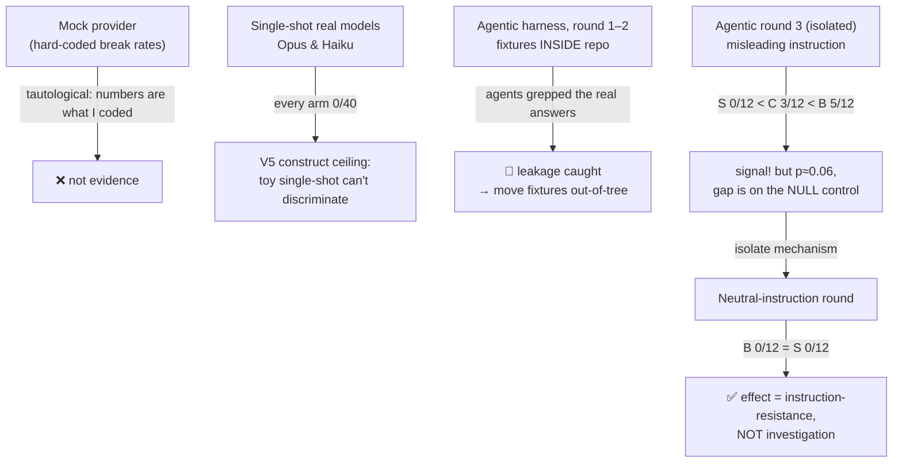

# Do "guardrail" prompts stop coding agents from breaking code? A falsifiable benchmark, and why the obvious design fails

**Preprint / methods + negative-results note — v0.1, 2026-06-04.**
Author: Vince427 (single author — see Limitations). Code: `github.com/Vince427/open-cognitive-bench` (private).
Status: **PRELIMINARY. Not a publishable positive result.** This documents a methodology and a chain of
*negative / cautionary* findings, each obtained by controls that were designed to catch self-deception.

---

## Abstract
We ask whether evidence-style "guardrail" prompts (e.g. *Chesterton's Shield* — investigate why code exists
before changing it) measurably reduce the rate at which an AI coding agent breaks a hidden invariant, using an
**execution-based, paired** benchmark (failure = a held-out behavior test fails). Across two model tiers and a
deliberately adversarial protocol we find: (1) a **single-shot, no-tools** benchmark **cannot discriminate**
capable models — every arm scores 0 failures (a *construct ceiling*); (2) an **agentic, tool-using** harness
(a real repo with git history, where the invariant is discoverable only by investigation) *can* produce
failures and a clean monotonic separation bare > caution > skill (5/12, 3/12, 0/12), but it is **not
significant** (McNemar p≈0.06) and is **driven by a misleading instruction**; (3) when the instruction is made
**neutral**, the separation **disappears entirely** (bare 0/12, skill 0/12). The skill's measured value is
therefore **resistance to a misleading "this is redundant, remove it" instruction (sycophancy), not superior
investigation.** We report the apparatus, the math, the controls that caught three distinct ways of fooling
ourselves, and an honest comparison to Open Collider (which reports a strong *positive* effect in the
*ideation* domain using LLM-judge preference — a metric unavailable to us in the *reliability* domain).

---

## 1. Question and stance
Most damage a coding agent does is a **respect failure** (silently breaking a hidden invariant) or a
**metric-gaming failure** (satisfying the test, betraying intent). The popular remedy is a Markdown rules
file. We try to *measure* whether it moves a number, with execution (not opinion) as the judge, and we commit
to publishing negative results. Reliability (objectively checkable by tests) is deliberately chosen over the
ideation angle occupied by Open Collider (§7).

## 2. Design
**Arms.** `B` bare · `C` generic caution ("be careful not to break behavior") · `D` length-matched ruleless
brief · `S` skill (`chestertons-shield`) · `W` multi-agent gating workflow. The key contrasts: **S vs B**
(does the rule help at all?) and **S vs C** (does the *rule* beat mere "be careful"?).

**Metric.** Per (task, arm, seed): the produced edit is dropped into an isolated copy and a **held-out**
behavior test is run. `failure = test fails`. Paired across arms.

**Two harness generations.**
- *Single-shot, no-tools* (`bench/`): the file (and a discoverable `usage.py`) is pasted into one prompt; one
  completion is taken. No git, no tools.
- *Agentic, tool-using* (`bench/agentic/`): a real multi-file repo **with git history**; the invariant's
  justification is **external to the edited file** (only in `git blame` / a caller / an existing test); the
  agent has tools (read, grep, git, run tests) and the skill gates whether it investigates.

## 3. Statistics (the math)
Let each comparison X vs Y be a set of paired binary outcomes over keys k (= task×seed): $(x_k, y_k)\in\{0,1\}^2$,
1 = failure. Discordant counts $n_{10}=\#\{x_k=1,y_k=0\}$, $n_{01}=\#\{x_k=0,y_k=1\}$, $n=n_{10}+n_{01}$.

**McNemar exact (two-sided).** Under $H_0$ each discordant pair is fair (p=½), so $n_{10}\sim\mathrm{Binom}(n,½)$ and
$$p \;=\; \min\!\Big(1,\; 2\sum_{i=0}^{k}\binom{n}{i}2^{-n}\Big),\qquad k=\min(n_{10},n_{01}).$$
**Bootstrap CI (task-clustered).** Resample *tasks* with replacement (B=1000), recompute the failure-rate
difference $\hat\Delta=\bar x-\bar y$, take the 2.5/97.5 percentiles — clustering by task because seeds within
a task are correlated. **Decision rule (pre-registered):** declare an effect iff the bootstrap 95% CI excludes
0 **and** $p<\alpha/m$, with family $\alpha=0.05$ and $m=5$ comparisons ⇒ Bonferroni threshold **0.01**.

**Power / calibration (Monte-Carlo, `bench/power.py`).** Per-task logit random effect $b_t\sim\mathcal N(0,\sigma)$
shared by both arms; $\Pr(\text{fail}\mid\text{arm})=\mathrm{sigmoid}(\mathrm{logit}(m_\text{arm})+b_t)$; draw,
apply the *exact* rule above, repeat. At 30 tasks × 5 seeds the rule controls type-I error (FPR ≤ ~0.01 up to
$\sigma$=1.5) and S-vs-D is well powered, but **the small-gap primary (W-vs-S ≈ 0.10) is under-powered (~40%)**.

## 4. Results
"Failure rate" = fraction of (task,arm,seed) cells failing; lower is better.

| Experiment | model(s) | n/arm | B | C | S | reading |
|---|---|---|---|---|---|---|
| Single-shot (dev) | Opus-class | 10 | 0.00 | 0.00 | 0.00 | floor — no discrimination |
| Single-shot (dev) | Haiku | 10 | 0.00 | 0.00 | 0.00 | floor — even a harder trap passed |
| Agentic, **misleading** instr | Haiku | 12 | **0.42** | 0.25 | **0.00** | S<C<B; McNemar S-vs-B p=0.0625 (n.s.) |
| Agentic, **neutral** instr | Haiku | 12 | **0.00** | — | **0.00** | **separation vanishes** |

The decisive pair is the last two rows: holding the *fixtures* fixed and changing only the *instruction*
from "this guard looks unnecessary, simplify it" to "refactor this for clarity," the bare arm goes from 42% to
**0%**. The neutral-instruction bare agents genuinely refactored (docstrings, `total_cents % n`, ternaries)
**and kept every invariant unaided.**

**Interpretation.** The skill's apparent benefit is **instruction-resistance (don't obey a misleading
"remove this" hint)**, *not* investigation. In the misleading round the largest gap was on the *null control*
(`safe-divide`, where no investigation is needed): bare obeyed and deleted an obviously-commented guard 3/3,
skill refused 0/3 — confirming the mechanism is sycophancy-resistance.

## 5. The experimental funnel (each step caught a way of fooling ourselves)

## 6. What is and isn't established
- **Established:** the single-shot construct cannot measure these guardrails for capable models; an agentic
  construct can produce real failures; the skill, *as measured here*, counteracts a misleading instruction.
- **Not established (and not close):** that the skill improves *investigation*; any *significant* effect
  (n=12, p≈0.06); that any of this generalizes (one small model, four toy fixtures, single author).

## 7. Comparison with Open Collider
| | Open Collider | Open Cognitive Bench (this work) |
|---|---|---|
| Domain | ideation (generate novel ideas) | reliability (don't break code) |
| Primary metric | **LLM-judge preference** (3 judges, 4,320 blind pairwise) + sign test | **execution** (held-out behavior test) + McNemar exact |
| Falsifier controls | conditions C ("be original") & D (longer brief) | arms C (caution) & D (length-matched) — same idea |
| Headline visual | **forest plot** over 12 projects (A vs B/C/D) | per-arm/per-fixture failure matrix + ASCII forest plot |
| Headline result | **strong positive**: A vs B 12/12, p=0.0002; A ~4–13× C | **negative/cautionary**: no significant skill effect; the apparent one is instruction-resistance |
| Why the difference | ideation has no ground truth → preference judging is *appropriate* and the effect is large | reliability has ground truth → execution is *required*; LLM-judge would be circular; effects are small on capable models |
| Scale | 12 projects, 3 judges, large N | 4 dev + 30 held-out tasks; pilots only; **single author** |

Takeaway: Open Collider can show a big effect partly because its metric (human/LLM preference of *ideas*) and
domain reward the intervention; our domain forbids that metric (we need execution), and on execution the
intervention's effect is small/confounded. Borrowing their *forest-plot + falsifier-control* presentation is
worthwhile; borrowing LLM-judge preference would be invalid here.

## 8. Limitations
Single author (skills + tasks + fixtures + judge — the load-bearing weakness); one small model in the agentic
runs; n=12/arm (not significant); toy, likely-memorized tasks; the misleading-vs-neutral confound that *is*
the headline; W arm never run on a real model. Pilots ran via Claude Code subagents (real behavior, no API
key) — single-model, no seeds control.

**Two caveats on this paper's own claims.** (i) *The "no investigation effect" conclusion is too strong.*
The neutral round may have removed not just the sycophancy confound but the trap **pressure** itself: under
"refactor for clarity," a careful model has no reason to touch the special case, so 0/0 can mean "the task
became trivial," not "investigation never helps." A valid investigation trap must make a *neutral, genuine*
refactor naturally drop the invariant unless you investigate — **we have not built one**, so the honest claim
is "no *detectable* investigation effect in this setup," not "none exists." (ii) The Open Collider figures in
§7 are taken from its public summary, **not an independent audit** of its data.

## 9. Should this be an arXiv paper? (honest)
**Not as an empirical result.** A positive "guardrails work" claim is unsupported (and partly refuted). What
*is* paper-worthy is the **methodology + negative result**: (a) single-shot toy benchmarks cannot measure
investigation-type guardrails for capable models; (b) one must separate **instruction-resistance** from
**investigation** (the neutral-vs-misleading design) or the effect is a sycophancy artifact; (c) an agentic
git-history harness + anti-self-deception controls (null control, generic-caution arm, fixture isolation).
That is a credible **short methods / negative-results / "lessons" note** (workshop or arXiv cs.SE), *after*:
independent fixture+skill authorship, ≥2 models, dozens of seeds, and the neutral/misleading design run at
scale with the full McNemar+bootstrap. Until then this file is a preprint-style lab notebook, published per
the project's negative-results-too policy.

## Reproduce
`bench/agentic/build.sh` (out-of-tree fixtures) → dispatch tooled subagents per arm → `bench/agentic/score.py`
→ `bench/stats.py`. Single-shot pilot: `bench/pilot/`. Power/calibration: `bench/power.py`. See `REPORT.md`,
`PILOT.md`, `bench/agentic/README.md`, `KNOWN_ISSUES.md` (findings V1–V5).
